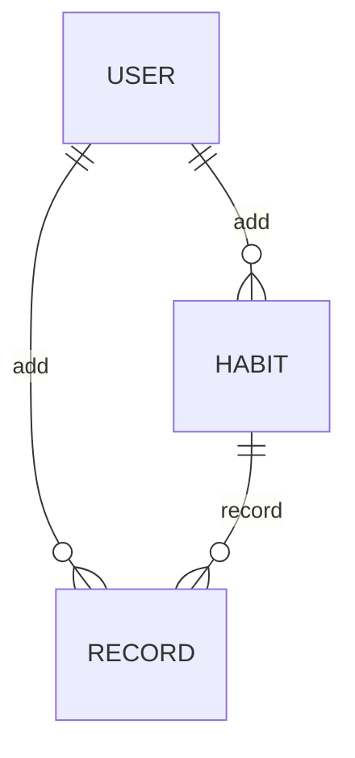

# habit-rails-api

## Design

### Feature

* User は Google 認証によってログインできる
* User は "習慣"を登録・編集・削除ができる
* User は "習慣の記録"を登録・削除ができる

### ER Diagram


```mermaid
erDiagram

          USER ||--　o{ HABIT : add
          USER ||--　o{ RECORD : add
          HABIT ||--　o{ RECORD : record
```


## local development

```
docker-compose up
```
