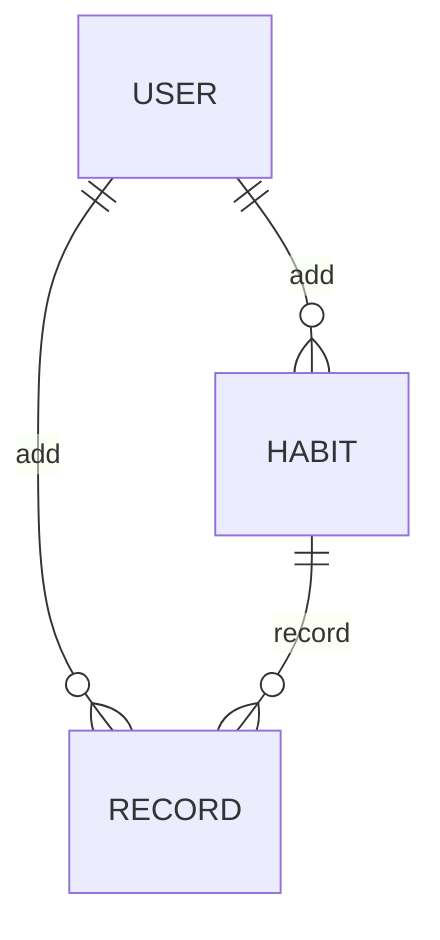

# habit-rails-api

## Design

### Feature

* User は Google 認証によってログインできる
* User は "習慣"を登録・編集・削除ができる
* User は "習慣の記録"を登録・削除ができる

### ER Diagram



### Schema

HABIT
* name
* user_id

RECORD
* date
* habit_id

## GraphQL example

### Habit

#### Get

```
query {
  habit(id: "2") {
    id
    name
    records {
      id
      date
    }
  }
}
```

#### Create

```
mutation ($input: CreateHabitInput!) {
  createHabit(input: $input) {
    habit {
      name
    }
  }
}
```

```
{
  "input": {
      "name": "ストレッチする"
    }
}
```

#### Update

```
mutation ($input: UpdateHabitInput!) {
  updateHabit(input: $input) {
    habit {
      id
      name
    }
  }
}
```

```
{
  "input": {
      "id": 2,
      "name": "ビールを2リットル飲む"
    }
}
```

#### Delete

## local development

```
docker-compose up
```
